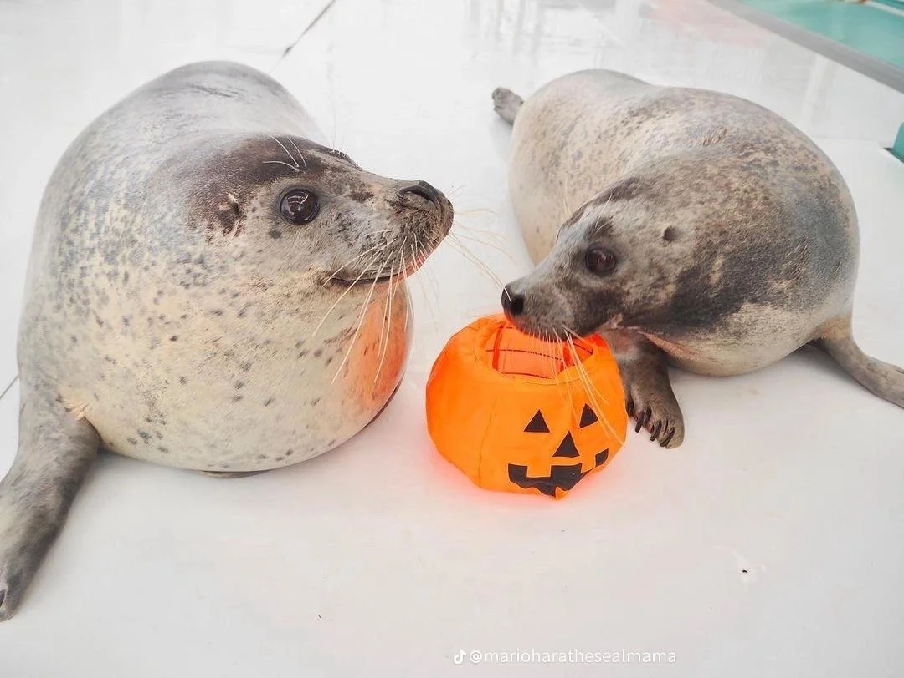
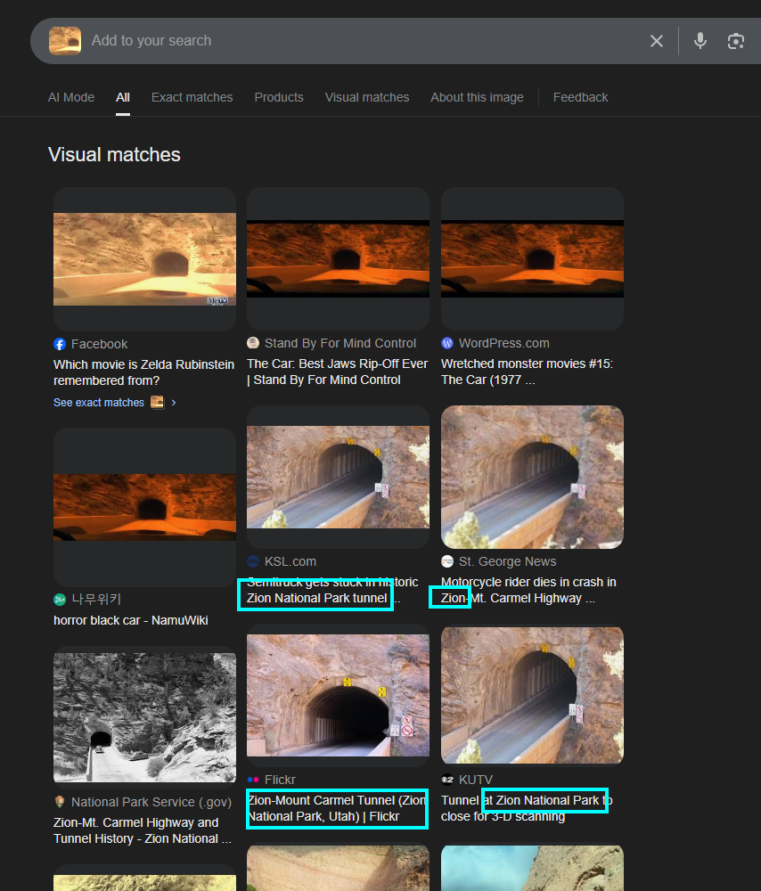
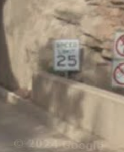
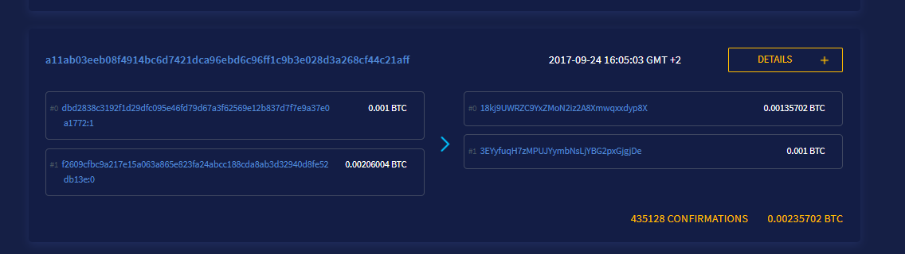

<h1> Haunted Pumpkin CTF '25 </h1>
<h3> Fun CTF organized by OSINT Switzerland </h3>
<h4>DISCLAIMER: All of these challenges were made for educational purposes only and should not be used for malicious purposes. I do not own any of the challenge assets below, all credits go to OSINT switzerland.</h4>

(they're friendly)

 

## Dictionary

RIS - Reverse Image Search  
Steg - steganography  
(Google) dork - advanced search query  

 

## Introduction

> Your entry flag, brave investigator, is the key into the Realm of the Pumpkin… 🎃🔑  
> 🎃🎃🎃 hpCTF{Th4nk5_4_F0ll0w1ng_Th3_Ru135} 🎃🎃🎃

Arguably one of the hardest challenges. Jokes aside, the flag was at the end of the text.

Flag

Flag: `hpCTF{Th4nk5_4_F0ll0w1ng_Th3_Ru135}`

 

## Horror Clowns

> A few years ago, there were some people dressing up as Horror Clowns, showing up out of nowhere scaring the hell out of people as can be seen in the following staged video.
> Link: https://www.youtube.com/watch?v=vaXjN3zChyE   
> Can you find the name of the train station at minute 01:56?   
> Flag format: `hpCTF{station name}`  
> Flag example: `hpCTF{******* ***********}`

    
Steps

1. Get a frame from the video that includes a decent amount of context

2. Use Google RIS on the match and click on the station, it should auto select

3. Going to the website of the first/second match you'll find the image, which leads you to the station

    
Flag

    Flag: `hpCTF{Perugia Silvestrini}`

 

## My identity
> We recorded a grave raider last night.  
> Every information that can lead finding this person is a big help.  
> Maybe start with the birthday?   
> Flag Format: `hpCTF{YYYYMMDD}`  
> Flag Example: `hpCTF{19900615}`   
> Challenge image:

    
Steps

1. Zooming closer in to the wallet, you'll see a coupe lines of gibberish. In Switzerland we call it bureaucracy though, anyways

2. Doing some research, this code seems to follow the MRZ TD1 standard, more specifically the second line

3. Simply extract the first 6 digits and you'll have the birthday

    
Flag

    Flag: `hkCTF{19640812}`

 

## My identity - 2

> Great, the birthday is a good start!  
> But tell me, belongs this passport really to the man in the image?  
> Answer with yes or no.   
> Flag Format: `hpCTF{<yes|no>}`

    
Steps

1. Reusing the image from last challenge you'll have to figure out if this passport belongs to the person on the image
2. You can clearly see that the person in the image is male, the MRZ TD1 on the image however shows that person is a female (The 8th character is a "F") 
    -> gender mismatch

    
Flag

Flag: `hpCTF{no}`  
Reason: Different Gender

 

## Ghost Ship

> A Ghost Ship was found ashore.  
> Can you find the IMO number of the ship.   
> Flag Format: hpCTF{IMO_nr}   
> Challenge image:

    
Steps

1. Usually these types of locations are pretty easily findable with Google RIS, so that's what I did

2. Google found multiple exact matches for the image which all relate to the ship "MV Alta"

3. Using a quick google dork `"MV Alta" + "IMO"` you'll find the IMO pretty quickly

    
Flag

Flag: `hpCTF{7432305}`

## Ghost Ship - 2

> Can you also find out where the ship currently is ?

Of course I can.

    
Steps

1. I proceeded to google dork the ships name with location ("MV Alta" + "location") again and got the following match: https://www.theultimateroadtripresource.com/location/discover-new-adventures/ghost-ship-mv-alta
2. The website showed a location near Ballyandreen Beach (51.81141248317834, -8.056514248978711), which we confirmed using satellite imagery

(Source: Google Maps)

    
Flag

Flag: `51.81141248317834, -8.056514248978711` (on the map)

 

## Dude where was this car

> You leave the tunnel where the car enters at the end of the clip: https://www.youtube.com/watch?v=j6-yVoJTCo8  
> There is a little public rest room with a green roof at the parking lot on the left side (Year 2021).  
> A few meters further (also on the left side) there is a sign which was build between 2008 and 2009.   
> What does the sign say?   
> Flag Format: hpCTF{***** ***** **}

    
Steps

1. I started off with extracting a frame from the video, that I thought contained the most information and google RISed it. The Facebook post had a much clearer image without any filter, so I decided to reuse that image to RIS again.

2. Looking at the second RIS, you'll see a lot of sources mentioning Zion national park (Utah, US). As the question mentions a restroom, its safe to assume that its close to the tunnel entrance. 
   I checked both tunnel exits for a parking lot and a house with a green roof and eventually found [this restroom house](https://maps.app.goo.gl/8XbZzcn7VkTiNHAv5).
3. Looking at the streetview from 2009, we were able to find the following sign at the tunnel entrance: 

    
Flag

Flag: `hpCTF{Speed Limit 25}`

 

## I Like Trains

> What classification code is written on the side of that train?   
> Flag Format: hpCTF{* *** * ****}   
> Challenge image:

    
Steps

1. The image doesn't really have any context, so I decided to google RIS yet again

2. The first match looks the exact same and seems to be a frame of [this video](https://www.youtube.com/watch?v=kqp9uFIQtMM).
3. As the video contains no identifiers and the description doesn't mention the classification code, we'll have to google dork the name in the description with the site trains.com (`"Markus Zaugg" + "snowplow" site:trains.com`).
4. You'll have to check for yourself, but for me the first match linked to an article with a snowplow. The article mentions the name "Xrot 9213", which with a quick google search revealed the full classification code.

    
Flag

Flag: `hpCTF{X Rot d 9213}`

 

## Trash Belongs Into The Bin

> Look what someone threw into the bin: 6W2XQjJP  
> This does not look like a youtube extension to me ... But wait, there is something written next to it:  
> “He crafts his games with fear and might,  
> A puzzling man who haunts the night.   
> The hash will lead, now take your chance—   
> The file you find with a second glance ”    
> Which wicked and malicious file holds this individuums name?     
> Flag Format: `hpCTF{******.***}`  
> Flag Example: `hpCTF{sealss.exe}`

    
Steps

1. The challenge title and description themselves already have quite a few hints. More specifically "the bin" and "the file". The first thing I thought of checking out was pastebin, as it pretty much checks both boxes.
2. There was a file with that path indeed: https://pastebin.com/6W2XQjJP. It contained a hash, presumably a file hash.
3. Whenever you encounter a file hash, you should check out VirusTotal and look it up there. You can see file names in the details tab, so I decided to check that and there it was!

    
Flag

Flag: `hpCTF{Jigsaw.exe}`

 

## The Halloween Party

> There is Flag is in this room. I guess you know what to do ...   
> Flag format: `hpCTF{<flag>}`   
> Challenge Image:

    
Steps

1. The objective for this one is quite clear: Scan the QR code. Easier said than done as its slightly obstructed at the top right. 
2. We used QRazybox to reconstruct it, although its arguably easier just drawing the missing lines
 

3. Scanning the QR code gives you the flag

    
Flag

Flag: `hpCTF{051N7_5W17Z3RL4ND_H4LL0W33N_CTF}`

 

## Fake News

> Fake news like these spread more wildely than ever.  
> Can you find out who was actually arrested here?   
> Flag Format: `hpCTF{**** *** ***-*****}`   
> Challenge image:  

    
Steps

1. Cutting out a part of an image usually works pretty well most of the time, which worked for this one. The image on the right links to an article which includes part of the name: `Ryan Law`

2. Simply searching for him on google shows the full name

 

    
Flag

Flag: `hpCTF{Ryan Law Wait-kwong}`

 

## Fake News - 2

> Can you also find which age Ryan was when he was arrested?  
> Flag Format: hpCTF{**}

    
Steps

1. Carefully craft a google dork with his full name and the string "age" (`"ryan law wai-kwong" + "age"`)
2. Click the [first link](https://www.hongkongwatch.org/political-prisoner/2024/10/30/ryan-law-wai-kwong) which shows the age when he was arrested. You could also try to figure out his birthday and calculate the difference, but that's arguably more complicated.

    
Flag

Flag: `hpCTF{46}`

 

## Follow The Money

> a11ab03eeb08f4914bc6d7421dca96ebd6c96ff1c9b3e028d3a268cf44c21aff   
> Flag Format: `hpCTF{<programming_language>}`   
> Challenge image:

    
Steps

    
1. The provided image has some japanese text talking about a donation to a software development studio and us having to figure out what programming language they use the least, so lets do that.
2. That looks like a bitcoin TX hash to me, so I'll start looking on btcscan.org. Indeed, there was a TX with said hash, sent to the address `18kj9UWRZC9YxZMoN2iz2A8Xmwqxxdyp8X`, presumably the address of the software development studio referred to in the challenge description. 

3. Doing a quick google search with that BTC address, you'll find their website: https://flacon.github.io/donate/.
4. Heading to their GitHub, it'll show you the percentages of used programming languages on the right side, which in this case was `Roff`.

(disclaimer: technically speaking this is a markup language rather than a programming language)

    
Flag

Flag: `hpCTF{Roff}`

