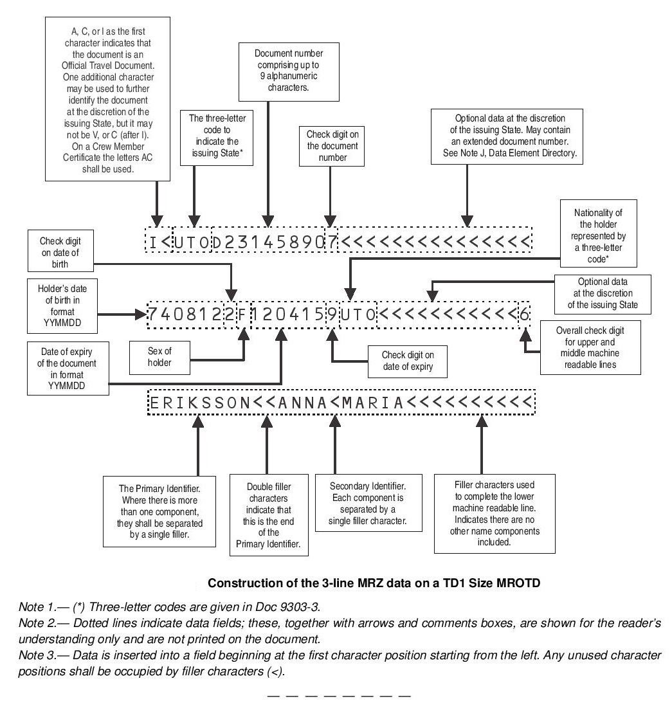

<h1> Haunted Pumpkin CTF '25 </h1>
<h3> Fun CTF organized by OSINT Switzerland </h3>

(they're friendly)

### Dictionary

RIS - Reverse Image Search  
Steg - steganography  

## Introduction

> Your entry flag, brave investigator, is the key into the Realm of the Pumpkin… 🎃🔑  
> 🎃🎃🎃 hpCTF{Th4nk5_4_F0ll0w1ng_Th3_Ru135} 🎃🎃🎃

Arguably one of the hardest challenges. Jokes aside, the flag was at the end of the text.

Flag

Flag: `hpCTF{Th4nk5_4_F0ll0w1ng_Th3_Ru135}`

## Horror Clowns

> A few years ago, there were some people dressing up as Horror Clowns, showing up out of nowhere scaring the hell out of people as can be seen in the following staged video.
> Link: https://www.youtube.com/watch?v=vaXjN3zChyE   
> Can you find the name of the train station at minute 01:56?   
> Flag format: `hpCTF{station name}`  
> Flag example: `hpCTF{******* ***********}`

    
Steps

1. Get a frame from the video that includes a decent amount of context

2. Use Google RIS on the match and click on the station, it should auto select

3. Going to the website of the first/second match you'll find the image, which leads you to the station

    
Flag

    Flag: `hpCTF{Perugia Silvestrini}`

## My identity
> We recorded a grave raider last night.  
> Every information that can lead finding this person is a big help.  
> Maybe start with the birthday?   
> Flag Format: `hpCTF{YYYYMMDD}`  
> Flag Example: `hpCTF{19900615}`   
> Challenge image:

    
Steps

1. Zooming closer in to the wallet, you'll see a coupe lines of gibberish. In Switzerland we call it bureaucracy though, anyways

2. Doing some research, this code seems to follow the MRZ TD1 standard, more specifically the second line

3. Simply extract the first 6 digits and you'll have the birthday

    
Flag

    Flag: `hkCTF{19640812}`

## My identity - 2

> Great, the birthday is a good start!  
> But tell me, belongs this passport really to the man in the image?  
> Answer with yes or no.   
> Flag Format: hpCTF{<yes|no>}

    
Steps

1. Reusing the image from last challenge you'll have to figure out if this passport belongs to the person on the image
2. You can clearly see that the person in the image is male, the MRZ TD1 on the image however shows that person is a female (The 8th character is a "F") 
    -> gender mismatch

    
Flag

Flag: `hpCTF{no}`  
Reason: Different Gender

