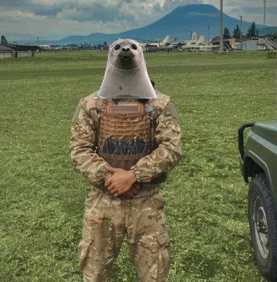
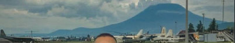
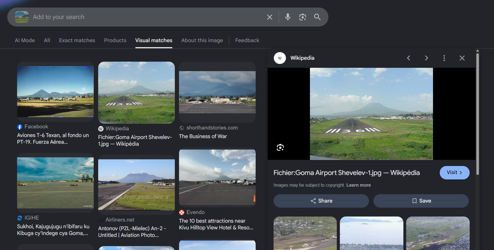
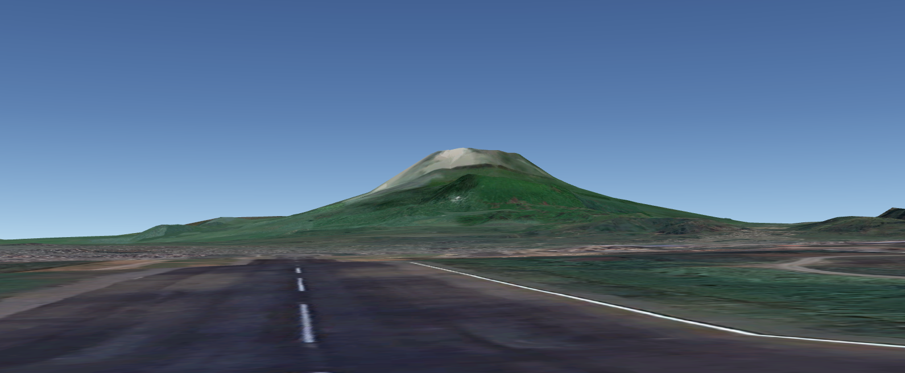
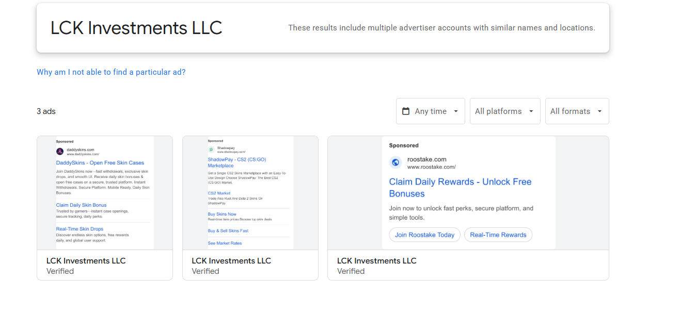
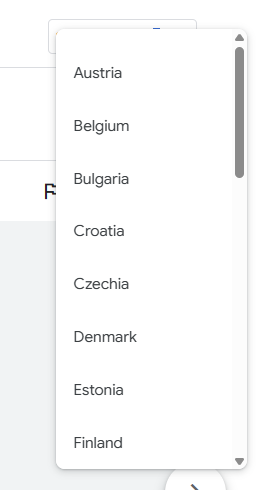
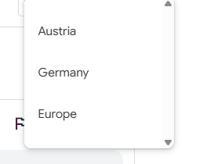

# Maltego Community CTF - February 2026

CTF organized by Maltego and CIRAT :)

LEGAL DISCLAIMER: All of these challenges are intended for educational purposes only. All challenge assets are owned by Maltego Technologies and CIRAT.
PII was redacted for privacy and legal reasons.
 

# Table of contents

### 1. [Romanian PMC](#romanian-pmc)
### 2. [One Shots](#one-shots)
### 3. [Gamer Gambling](#one-shots)

# Romanian PMC

### Part 1

> This person pictured below is standing near an airfield. Provide the ICAO code of this airport.  
> Picture:

    
Approach

For this challenge we were tasked with finding the airport this soldier is standing at. 
The easiest approach to solve this challenge is to reverse image search it. Landmarks usually provide the best matches, so we went ahead and RISed the mountain in the back (as seen below).

The image of the Goma Airport provided a near perfect match. But remember, Verifying is everything in OSINT, so we went ahead and verified it with Google Earth.

As you can probably tell by now, this is the correct airport. Getting the ICAO code is just one google search away now.

    
Flag

    Flag: `FZNA`

### Part 2

> [...] The person mentioned in that post (REDACTED) is linked to a company incorporated at this date: 2018-05-02. What is the name of this company?

    
Approach

Company data is public most of the time, meaning we should be able to use a dork to find more information. We're looking for the company that was founded in 2018 with REDACTED being a registered officer of it.
We converted the name to the latin alphabet as it usually yields better results and ended up with this dork:

``"REDACTED NAME" + "company" + "2018"``

which yielded both [African Energy Investment LTD](https://find-and-update.company-information.service.gov.uk/company/11342227) and [AO Futuro LTD](https://find-and-update.company-information.service.gov.uk/company/08409627), with only "African Energy Investment LTD" being founded on the given date.

    
Flag

    Flag: `African Energy Investment LTD`

### Part 3

> Before African Energy Investment ltd, REDACTED was the director of another company, incorporated at this date: 2013-02-19.

    
Approach

Checking the other company from the last challenge (Part 2) we can see that it was founded on 19th of February 2013, which matches this challenge! 2-in-1 :)

    
Flag

    Flag: `AO Futuro LTD`

### Part 3 - Bonus

> Who was the associate of REDACTED in African Energy Investment ltd?

    
Approach

Coming back to the page we found in part 2 we can head to the "People" tab, which lists all officers. As there was only one other officer than REDACTED, we can confidently assume that the other is the one we're looking for.

    
Flag

    Actual Flag redacted due to PII.

    Flag: `******* ********` (7 chars [_] 8 chars)

### Part 4 

> This article (https://www.riseproject.ro/en/investigations/uncategorized/how-chinese-companies-worked-with-REDACTED-NAME-a-former-mercenary/) mentions a company similarly named to AO FUTURO LTD, 
> linked to REDACTED, but located in Malta. It also mentions a woman cooperating with him and involved in this company.

    
Approach

We are tasked with finding a company named similarly to AO Futuro located in Malta that has a relation to REDACTED. Using this information we can craft another dork:

``"AO FUTURO" + "malta" + "SURNAME OF REDACTED"``.

Multiple sources (including the source above) mention a company named "AO Futuro LIMITED" with a connection to REDACTED based in Malta, which now has to be verified. Looking for an exact match on google we can find an offshore leaks database entry (https://offshoreleaks.icij.org/nodes/55063599).

Scrolling down to the officers we can see that there's only one female officer, the director & representative of the company.

    
Flag

    Actual Flag redacted for PII.

    Flag: `***** *****` (5 chars [_] 5 chars)

### Part 5

> There is another person mentionned in the paperwork: "REDACTED_2".
> What is his Facebook profile? Answer with the full URL.

    
Approach

Another day, another dork, this time using the site and the provided name:

``site:facebook.com + REDACTED_2``

Surprisingly this dork only yielded one match, with it being www.facebook.com/SURNAME.PRENAME of REDACTED_2. 
This can only be verified to the extent where the approximate age and the country matches with the one on Offshore Leaks.

    
Flag

    Actual Flag redacted for PII

    Flag: `www.facebook.com/SURNAME.PRENAME`

### Part 6

> On 2025-05-21, REDACTED_2 shared and commented on this picture. [Image of the house here]
> Using the information gathered in the previous questions, please find the name of the street where this house is located.
> Answer with the name of the street only.

    
Approach

There was one address that had a relation to REDACTED_2 mentioned on Offshore Leaks. We decided to check that out on street view just in case and indeed, there it was.

Note: The flag is just the street name without any numbers.

    
Flag

    Actual flag redacted for PII.

    Flag: `****** **** *****` (6 chars [_] 4 chars [_] 5 chars])

 

# One Shots

## Domain Pivot

> The person that first registered screeenshots.org also registered another domain, using the lesser known TLD cards.
> What is this domain? 
> Answer with the domain, not the URL (e.g: maltego.com not https://maltego.com)

    
Approach

First of all we have to figure who owned the `screeenshots.org` domain. We can use any historical WHOIS tool for this, such as Whoisxmlapi. 
We can see that the name was redacted in 2022, but historical data shows that it was owned by a Ukrainian person. 

Running a reverse WHOIS search with the name only returns a singular other domain, which does however have the ``.org`` TLD and therefore doesn't match.
Running a reverse WHOIS on the email returns 7 results on the other hand, which includes exactly one ``.cards`` domain.

    
Flag

    Flag: `dota2.cards`

## Google Ads

> This is a Google Ad that was served to Google users: https://adstransparency.google.com/advertiser/AR08481595089930420225/creative/CR03797993658062471169.
> The advertiser running the ad above, is also running other ads using Google Ads. Which one is being served in the smallest amount of regions?
> Answer with the "creative id" associated with this ad.
> For the ad used as an example this would be CR03797993658062471169.

    
Approach

We were given a Google Ads page that shows an ad of "LCK Investments LLC",  advertising a casino website. Using this company name we had to find the ad with the least amount of countries.
Looking for this name on the Google Ads Transparency center (https://adstransparency.google.com/?region=anywhere) we can see that there's 3 ads

Unfortunately there's no faster way than to manually go through all of them and check the regions. The first 2 were identical with the third one only have

Simply extract the creative ID from the URL for the third ad.

    
Flag

    Flag: `CR11259045643051597825`

 

# Gamer Gambling

### Part 1 

